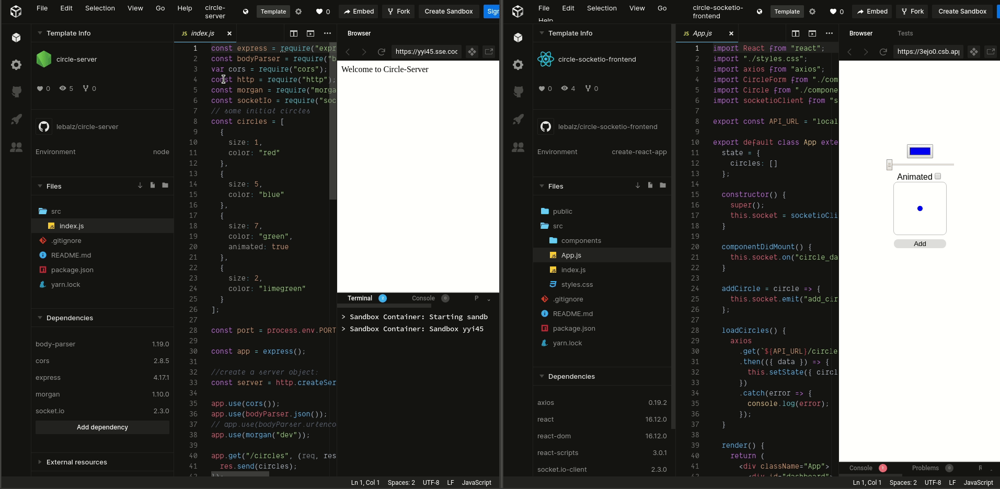

# Circle socket.io frontend

A javascript react project using sockets to receive data from the backend.

Check it out on [CodeSandbox](https://codesandbox.io/s/github/lebalz/circle-socketio-frontend)

This should be used in combination with the [circle-server](https://github.com/lebalz/circle-server).

Instead of pushing data forth and back, a polling frontend with pure http-requests can be seen [here: circle-http-frontend](https://github.com/lebalz/circle-http-frontend).


Remark that both clients get updated at the same time.

## install

```sh
yarn install
```

## run
```sh
yarn start
```

## Codesandbox

1. Make sure to first start a [Circle-Server Sandbox](https://codesandbox.io/s/github/lebalz/circle-server).

2. Copy the URL of the *Circle-Server Sandbox* instance. You then have to replace the `CIRCLE_SERVER_URL` in `App.js`.

